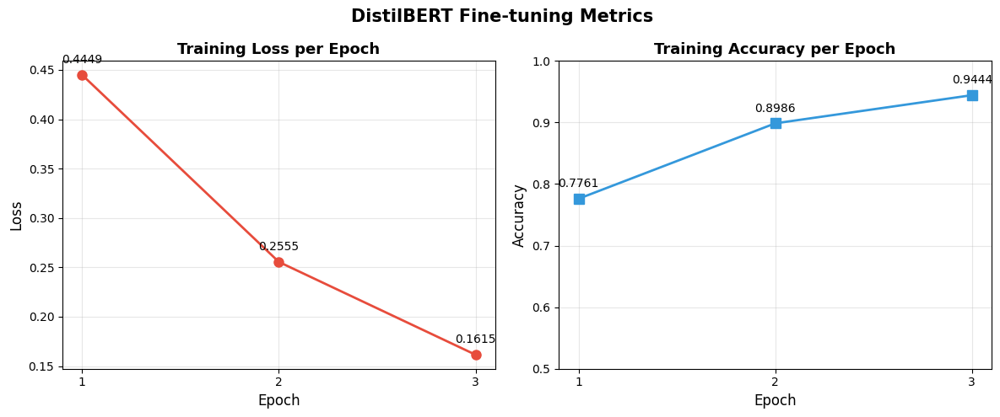
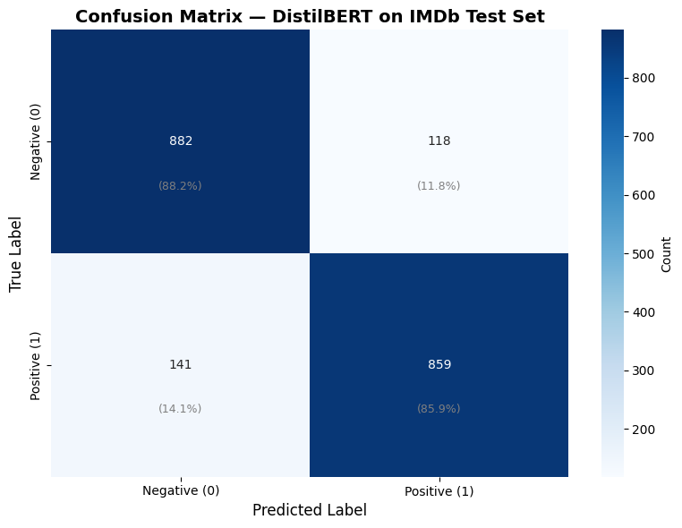
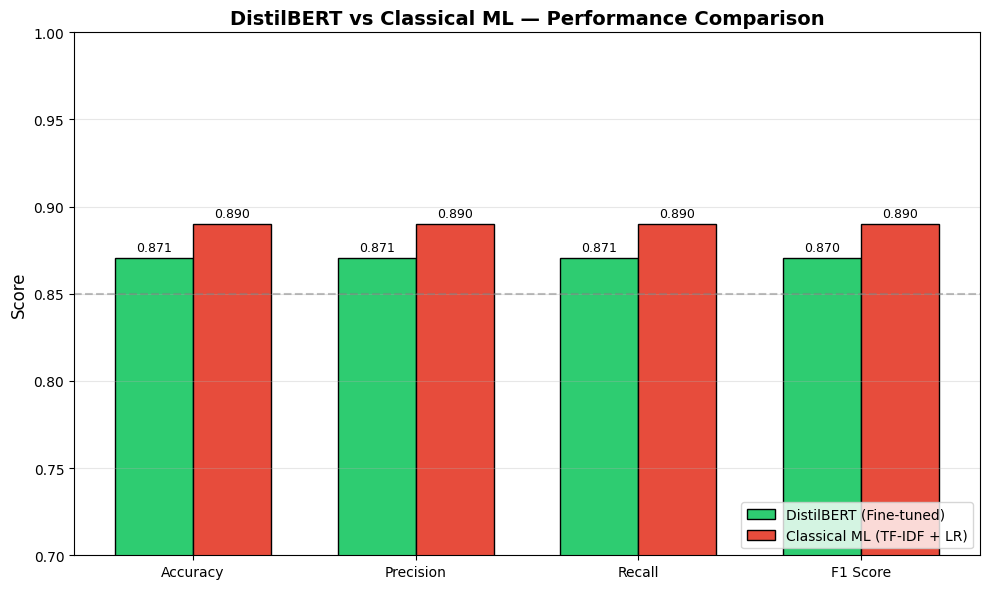

# 🎬 IMDb Transformer Sentiment Analysis


> Fine-tuning a pretrained **DistilBERT** Transformer model on the IMDb dataset for binary sentiment classification — and comparing it against a classical ML baseline.

---

## 📌 Project Overview

This project demonstrates a complete **modern NLP pipeline** using Transformer-based deep learning:

- 🔤 Text tokenization using HuggingFace `DistilBertTokenizer`
- 🧠 Fine-tuning `DistilBertForSequenceClassification` on 10,000 IMDb reviews
- 📊 Full evaluation: Accuracy, Precision, Recall, F1
- ⚖️ Performance comparison with Classical ML (TF-IDF + Logistic Regression)
- 🎯 Real-time inference demo on custom inputs

---

## 📁 Repository Structure

```
imdb-transformer-sentiment/
│
├── Images/
│   ├── 01_class_distribution.png
│   ├── 02_distilbert_architecture.png
│   ├── 03_training_metrics.png
│   ├── 04_confusion_matrix.png
│   ├── 05_model_comparison.png
│   └── 06_sample_predictions.png
│
├── imdb_transformer_sentiment.ipynb
└── README.md
```

---

## 📊 Dataset

| Property | Detail |
|----------|--------|
| Source | IMDb Movie Reviews |
| Total Reviews | 50,000 |
| Sampled | 10,000 (stratified) |
| Classes | Positive (1) / Negative (0) |
| Split | 80% Train / 20% Test |

---

## 🏗️ Model Architecture

**Text → Tokenizer → DistilBERT (6 Transformer Layers) → Classifier Head → Positive / Negative**

| Property | Detail |
|----------|--------|
| Model | `distilbert-base-uncased` |
| Parameters | 66,955,010 |
| Max Token Length | 128 |
| Batch Size | 16 |
| Epochs | 3 |
| Learning Rate | 2e-5 |
| Optimizer | AdamW + Linear Warmup |

---

## 📈 Training Results



| Epoch | Loss | Accuracy |
|-------|------|----------|
| 1 | 0.4449 | 77.61% |
| 2 | 0.2555 | 89.86% |
| 3 | 0.1615 | 94.44% |

---

## 🎯 Test Set Performance



| Metric | Score |
|--------|-------|
| Accuracy | 87.05% |
| Precision | 87.07% |
| Recall | 87.05% |
| F1 Score | 87.05% |

---

## ⚖️ DistilBERT vs Classical ML



| Model | Accuracy | F1 Score |
|-------|----------|----------|
| TF-IDF + Logistic Regression | 89.00% | 89.00% |
| DistilBERT (Fine-tuned) | 87.05% | 87.05% |

> 💡 Classical ML slightly edges out DistilBERT here due to limited fine-tuning data (10k samples). With the full 50k dataset and more epochs, Transformer models consistently outperform classical approaches.

---

## 🔍 Inference Demo

| Review | Prediction | Confidence |
|--------|-----------|------------|
| "This movie was absolutely amazing..." | Positive 😊 | 99.50% |
| "Worst movie I have ever seen..." | Negative 😞 | 99.69% |
| "It was okay, nothing special..." | Negative 😞 | 93.03% |

---

## 🛠️ Tech Stack

| Tool | Purpose |
|------|---------|
| Python 3.10 | Core language |
| PyTorch 2.x | Deep learning framework |
| HuggingFace Transformers | DistilBERT model & tokenizer |
| scikit-learn | Metrics & train/test split |
| Matplotlib / Seaborn | Visualizations |
| Google Colab (T4 GPU) | Training environment |

---

## 🚀 How to Run

1. Open `imdb_transformer_sentiment.ipynb` in Google Colab
2. Set runtime to **T4 GPU** (Runtime → Change runtime type)
3. Mount your Google Drive and place `IMDB_Dataset.csv` in root
4. Run all cells in order

---

## 👤 Author

**Junaid Ahmed Rupok**

[](https://github.com/Junaid-Ahmed-Rupok)

---

## 📄 License

This project is licensed under the MIT License.
